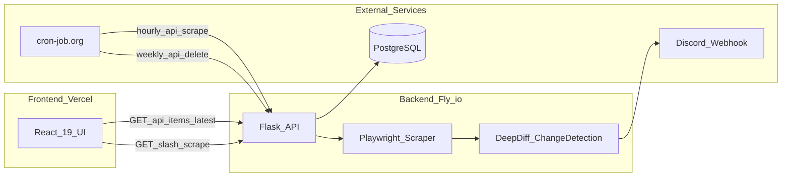

# MyNintendo Scraper


A full-stack monitoring app that scrapes the [My Nintendo rewards store](https://www.nintendo.com/store/exclusives/rewards/) hourly, detects listing changes, persists history in PostgreSQL, and sends Discord alerts.

**[Live Demo](https://mynintendo-scraper.vercel.app/)** · [Report Bug](https://github.com/samau3/mynintendo-scraper/issues) · [Request Feature](https://github.com/samau3/mynintendo-scraper/issues)

## Screenshots


## Features

- **Headless browser scraping** with Playwright — handles JS-rendered pages and "See all" pagination
- **Change detection** via DeepDiff with trademark false-positive filtering
- **Discord webhook notifications** when new, removed, or changed listings are detected
- **PostgreSQL persistence** with automatic TTL cleanup (7-day listings, 365-day change history)
- **Hourly automation** via [cron-job.org](https://cron-job.org) hitting the scrape API
- **Cached read endpoint** for fast UI loads without triggering a scrape on every visit
- **Themed React dashboard** with dark/light mode and Mario-inspired background animation
- **CI/CD** — server tests, frontend build, and Fly.io deploy gated on passing tests

## Architecture



**Data flow:** On page load, the React app fetches cached listings from `GET /api/items/latest` (fast, no scrape). Users can trigger a live scrape via "Scrape Again," which calls `GET /` and runs Playwright. Hourly cron jobs call `GET /api/scrape` for automated monitoring. When changes are detected, results are stored in PostgreSQL and a Discord webhook fires.

## Tech Stack

[](https://www.typescriptlang.org/)
[](https://reactjs.org/)
[](https://www.python.org/)
[](https://flask.palletsprojects.com/)
[](https://playwright.dev/)
[](https://www.postgresql.org/)
[](https://tailwindcss.com/)
[](https://www.docker.com/)

Also uses BeautifulSoup, DeepDiff, SQLAlchemy, Gunicorn, Vite, and GitHub Actions. Deployed on [Vercel](https://vercel.com/) (frontend) and [Fly.io](https://fly.io/) (API).

## API Reference

| Method | Endpoint | Description |
|--------|----------|-------------|
| `GET` | `/` | Full scrape + change detection + Discord notification |
| `GET` | `/api/items/latest` | Cached listings from database (no scrape) |
| `GET` | `/api/scrape` | Cron-friendly scrape; returns timestamp |
| `GET` | `/api/delete` | Delete expired database records |
| `GET` | `/api/get-items` | Scrape and return current items only |
| `GET` | `/api/check-fly` | API health check |
| `GET` | `/api/check-scraping` | Scraping functionality health check |
| `GET` | `/api/check-db` | Database health check |

## Getting Started

### Prerequisites

- Node.js 22+
- Python 3.13+
- [uv](https://docs.astral.sh/uv/) (`brew install uv` on macOS)
- PostgreSQL (or use `docker-compose` below)

### Installation

1. Clone the repository and copy environment variables:

   ```sh
   cp .env.example .env
   ```

   Edit `.env` with your `DATABASE_URL`. Discord webhook variables are optional for local development — scraping works without notifications.

2. **Frontend** (`app/`):

   ```sh
   cd app
   npm install
   npm start
   ```

3. **Backend** (`server/`):

   ```sh
   cd server
   uv sync
   uv run playwright install chromium
   uv run flask run
   ```

The frontend runs at `http://localhost:5173` and connects to the API at `http://127.0.0.1:5000`.

### Docker Compose (optional)

Run PostgreSQL and the API together:

```sh
cp .env.example .env
docker compose up --build
```

The API will be available at `http://localhost:5000`. See [server/README.Docker.md](server/README.Docker.md) for production Docker build details.

## Design Decisions

- **Playwright over requests** — the Nintendo rewards page is JS-rendered; a headless browser waits for product cards to load before parsing.
- **DeepDiff for change detection** — compares listing dictionaries and categorizes additions, removals, and value changes.
- **Trademark false-positive filtering** — Nintendo listings sometimes toggle `™` symbols; a helper filters these so they don't trigger false alerts.
- **CSS selector fragility** — styled-components generate hashed class names (`Hc9FH`, `EgihB`). The scraper uses regex partial matches and `data-testid`/`aria-label` attributes where possible, and raises `CSSTagSelectorError` (503) when the DOM structure changes.

## Testing

**Server:**

```sh
cd server
uv run pytest
uv run ruff check .
```

**Frontend:**

```sh
cd app
npm run test
npm run build
npm run format:check
```

## Deployment

| Component | Platform | Trigger |
|-----------|----------|---------|
| Frontend | Vercel | Auto-deploy on push |
| API | Fly.io | GitHub Actions on `main` merge to `server/**` (gated on tests) |

Manual Fly.io deploy: `cd server && flyctl deploy --remote-only`

### Database migrations

The app uses `db.create_all()` and does not run automatic schema migrations. When deploying a change that adds columns to existing tables, run the required SQL against your PostgreSQL database before or after deploy.

**Product images column** (required for cached listing images):

```sql
ALTER TABLE item_listings ADD COLUMN IF NOT EXISTS images JSON NOT NULL DEFAULT '{}';
```

Existing rows will have empty image maps until the next scrape or cron run populates them.

External cron jobs (configured at [cron-job.org](https://cron-job.org)):
- Hourly: `GET /api/scrape`
- Weekly: `GET /api/delete`

## Roadmap

<details>
<summary>Completed</summary>

- [x] CI/CD pipeline with GitHub Actions
- [x] Scrape My Nintendo rewards page with Playwright
- [x] Change detection and Discord notifications
- [x] React dashboard with themed UI
- [x] Automated hourly scraping and weekly DB cleanup
- [x] Unit tests for scraping helpers
- [x] Pytest migration with route and model tests
- [x] Cached read endpoint for faster UI loads
- [x] Frontend and server CI with linting

</details>

<details>
<summary>Planned</summary>

- [ ] Public distribution
- [ ] User account system
- [ ] Discord bot refinements (selective notifications, scrape command)

</details>

## Contributing

1. Fork the repository
2. Create a feature branch (`git checkout -b feature/my-feature`)
3. Commit your changes
4. Push and open a Pull Request

## Contact

**Sammy Au** — [GitHub](https://github.com/samau3) · [Project Repository](https://github.com/samau3/mynintendo-scraper)

## License

Distributed under the MIT License. See [LICENSE](LICENSE) for details.

## Acknowledgments

- [FreeCodeCamp](https://www.freecodecamp.org/) BeautifulSoup web scraping tutorial
- [Hyperplexed](https://www.youtube.com/watch?v=x872keruUWQ) for the Mario UI background inspiration
